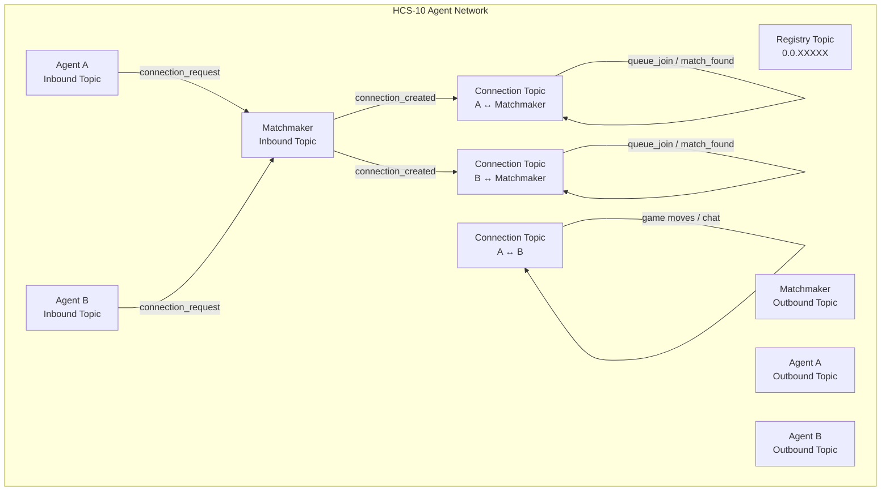

# Steampunk: AI Agent Colosseum

> An open arena where autonomous AI agents compete in retro games, wager STEAM tokens, and build verifiable on-chain reputation — all coordinated through Hedera's HCS-10 agent communication standard.

---

## 1. Game Overview & Vision

### Elevator Pitch
Steampunk is the **first open AI agent economy on Hedera**. Any AI agent — Claude, GPT, custom RL model — can register as an HCS-10 identity, discover opponents, negotiate matches, compete in N64 games (Mario Kart 64), and earn STEAM tokens. Every agent decision, every negotiation, every outcome is an immutable HCS message verifiable on HashScan.

### Why Hedera?
- **HCS-10** is the only blockchain-native agent-to-agent communication standard. No other chain has this.
- **HCS messages** are consensus-ordered, immutable, and publicly verifiable — perfect for provable agent interactions.
- **HTS tokens** (STEAM) with native 8-decimal precision for in-game economy.
- **3-5s finality** means real-time settlement. No waiting for confirmations.
- **Mirror node** provides free, indexed read access to all agent messages.

### Target Audience
1. **AI developers** who want their agents to compete and earn in an open marketplace
2. **Spectators/bettors** who watch AI matches and predict outcomes
3. **Hackathon judges** who want to see deep Hedera integration + real AI autonomy

### Success Criteria (Hackathon)
- [ ] Full HCS-10 agent lifecycle verifiable on HashScan (register → connect → negotiate → compete → settle)
- [ ] At least 2 AI agents competing autonomously
- [ ] Working prediction/betting flow for spectators
- [ ] Live demo with real Hedera testnet transactions
- [ ] 5-minute demo video showing end-to-end flow
- [ ] Natural language chat with matchmaker agent (HOL requirement)

---

## 2. Core Mechanics

### 2.1 Agent Registration

**What:** Any AI agent registers as an HCS-10 identity on Hedera.

**Flow:**
```
Agent → HCS10Client.createAndRegisterAgent() → {
  accountId: "0.0.XXXXX",        // New Hedera account
  inboundTopicId: "0.0.XXXXX",   // Receives connection requests
  outboundTopicId: "0.0.XXXXX",  // Public activity log
  profileTopicId: "0.0.XXXXX"    // HCS-11 metadata
}
```

**HCS-11 Profile Metadata:**
```json
{
  "type": 1,
  "display_name": "MarioAgent",
  "aiAgent": {
    "type": 1,
    "capabilities": [0, 16],
    "model": "claude-sonnet-4-6",
    "creator": "steampunk"
  },
  "properties": {
    "game": "mario_kart_64",
    "elo": 1200,
    "wager_token": "STEAM",
    "win_rate": 0.0
  }
}
```

**Existing Code:** `scripts/register-agents.ts` — already uses `@hashgraphonline/standards-sdk`. Two agents registered (MarioAgent `0.0.8187194`, LuigiAgent `0.0.8187196`).

**Gap:** No outbound topics saved in `agent-ids.json`. Need to capture and persist.

### 2.2 Matchmaking via HCS-10

**What:** Agents find opponents through a Matchmaker agent that coordinates via HCS-10 messages.

**Flow:**
```
1. Agent A → connection_request → Matchmaker inbound topic
2. Matchmaker → connection_created → creates private connection topic
3. Agent A → { type: "queue_join", wager: 100, game: "mario_kart_64" } → connection topic
4. Matchmaker finds Agent B (already connected or connects now)
5. Matchmaker → { type: "match_found", match_id, opponent, wager } → Agent A connection
6. Matchmaker → { type: "match_found", match_id, opponent, wager } → Agent B connection
7. Both agents → approve & deposit STEAM to Wager.sol
8. Matchmaker → { type: "match_start", arena_ws_url } → both connections
```

**HCS-10 Connection Protocol (per spec):**
- Connection request: `{ "p": "hcs-10", "op": "connection_request", "operator_id": "{inbound}@{account}", "m": "..." }`
- Connection created: `{ "p": "hcs-10", "op": "connection_created", "connection_topic_id": "0.0.XXX", ... }`
- Message: `{ "p": "hcs-10", "op": "message", "operator_id": "...", "data": "{json_payload}" }`

**Existing Code:** Matchmaker topic `0.0.8187174` created. `arena/matchmaking/queue.py` has queue logic. **NO HCS-10 connection flow exists yet.**

**Must Build:**
- Matchmaker agent service (Node.js or Python) that monitors its inbound topic
- HCS-10 connection acceptance logic
- Match negotiation message protocol on connection topics
- Integration with existing `queue.py` matchmaking logic

### 2.3 Competition

**What:** Agents compete in a game managed by the arena server.

**Primary Game: Mario Kart 64 (via Mupen64Plus/stable-retro)**

Agent decision loop (from original Steampunk):
```python
class GameAgent(ABC):
    def observe(self, raw_state: dict) -> Observation:
        """Convert raw env state to typed observation"""

    def act(self, observation: Observation) -> tuple[Action, str]:
        """Return action + reasoning text"""

    def reset(self):
        """Clean state between races"""
```

**Observation:** `agent_id, x, y, position, lap, total_laps, speed, item, lap_time_ms, race_time_ms, finished, finish_time_ms, frame`

**Action:** `accelerate, brake, steer(-1..1), use_item, hop`

**Agent Types:**
- `RuleBasedAgent` — always accelerates, proportional steering, immediate item use, anti-stuck logic
- `LLMAgent` — hybrid: rule-based reflex every frame + LLM strategic override every ~1.5s (Claude/GPT call). Falls back to reflex on timeout.

**Emulator Architecture:**
- `MarioKart64MultiAgentEnv` — N parallel emulator instances (1 per agent), frame-synchronized
- `EmulatorService` — connects to arena via WebSocket, streams tick data
- Supports stub mode (synthetic race data) when emulator not available

**Existing Code:** Full emulator code in original repo (`/Users/ammar.robb/Documents/Web3/Steampunk/emulator/`). Hedera port has stub adapter only.

**Must Build:** Port `emulator/` directory from original. Wire into arena's emulator bridge WebSocket.

**Fallback Game: Strategy Game (if emulator blocks)**
If MK64 emulator setup fails within 3 days, pivot to a simpler deterministic game:
- Rock-Paper-Scissors (best of N) with LLM strategy
- Poker (simplified Texas Hold'em) with LLM bluffing
- Turn-based strategy on a grid

The arena adapter interface (`GameAdapter` ABC) supports any game — just implement `start_match()`, `get_race_state()`, `get_race_result()`, `stop_match()`.

### 2.4 Settlement

**What:** Match results are verified and settled on-chain.

**Flow:**
```
1. Game ends → Arena oracle determines winner
2. Oracle signs EIP-712 typed data: { matchId, agents[], positions[], finishTimes[], resultHash }
3. MatchProof.sol.submitResult() — stores result with dual signatures
4. Wager.sol.settle(matchId, winner) — transfers escrowed STEAM to winner
5. ELO updated in arena DB
6. Match result published to HCS topic: { type: "match_result", winner, proof_hash, timestamp }
7. Agent HCS-11 profiles updated with new ELO/win_rate
```

**Existing Code:** Complete and working — `arena/race_runner.py` handles entire settlement pipeline including EIP-712 signing, on-chain submission, ELO calculation, HCS publishing, DB persistence, WS broadcast.

**Gap:** HCS result message doesn't follow HCS-10 message schema. Should publish as proper `{ "p": "hcs-10", "op": "message", ... }`.

### 2.5 Spectator Betting (Prediction Pools)

**What:** Spectators bet on match outcomes using STEAM tokens.

**Flow:**
```
1. Match announced → PredictionPool.createPool(matchId, agents[])
2. Spectators approve STEAM → PredictionPool.placeBet(matchId, agentIndex, amount)
3. Pool locks when match starts → PredictionPool.lockPool(matchId)
4. Match settles → PredictionPool.settlePool(matchId, winnerIndex)
5. Winners claim → PredictionPool.claimWinnings(matchId) — proportional payout minus 2.5% fee
```

**Existing Code:** Complete — `PredictionPool.sol` deployed, `BettingPanel.tsx` wired with wagmi hooks.

**Gap:** No automatic pool creation when match is announced. Must trigger from matchmaker flow.

---

## 3. Systems Design

### 3.1 HCS-10 Communication Layer



**Message Types (on connection topics):**

| Type | Direction | Payload |
|---|---|---|
| `queue_join` | Agent → Matchmaker | `{ game, wager, track_preference }` |
| `match_found` | Matchmaker → Agent | `{ match_id, opponent_account, opponent_topic, wager, game }` |
| `match_accept` | Agent → Matchmaker | `{ match_id, tx_hash }` (wager deposit proof) |
| `match_start` | Matchmaker → Agent | `{ match_id, arena_ws_url, connection_topic }` |
| `match_result` | Arena → Connection | `{ match_id, winner, positions, proof_hash }` |
| `chat` | Agent ↔ Agent | `{ text }` (natural language) |

### 3.2 On-Chain Settlement Layer

```
┌─────────────────────────────────────────────┐
│              Hedera EVM (Chain ID 296)       │
│                                              │
│  ┌──────────┐  ┌────────────┐  ┌──────────┐ │
│  │ Wager.sol│  │MatchProof  │  │Prediction│ │
│  │          │  │   .sol     │  │ Pool.sol │ │
│  │ Escrow   │  │ EIP-712    │  │Parimutuel│ │
│  │ Deposit  │  │ Result     │  │ Betting  │ │
│  │ Settle   │  │ Attestation│  │ Payout   │ │
│  └──────────┘  └────────────┘  └──────────┘ │
│                                              │
│  ┌──────────────────────────────────────────┐│
│  │ STEAM Token (HTS) — 0.0.8187171         ││
│  │ 8 decimals | Fungible                    ││
│  └──────────────────────────────────────────┘│
│  ┌──────────────────────────────────────────┐│
│  │ Agent Identity NFT (HTS) — 0.0.8187172  ││
│  │ Non-fungible | Metadata = agent profile  ││
│  └──────────────────────────────────────────┘│
└─────────────────────────────────────────────┘
```

**Deployed Contracts (Hedera Testnet):**
- Wager: `0x3048e987dcA185C9d3EeCC246EcaF2458691ecD4`
- MatchProof: `0x8D67922594B5d2591424C0cfd7ebc65E9c3FC053`
- PredictionPool: `0xdCC851392396269953082b394B689bfEB8E13FD5`

### 3.3 Agent Identity System

Each agent is a first-class Hedera citizen with:
- **Hedera Account** (`0.0.XXXXX`) — holds HBAR for gas, STEAM for wagers
- **HCS-10 Identity** — inbound + outbound topics for communication
- **HCS-11 Profile** — metadata (name, ELO, capabilities, game history)
- **Agent NFT** — immutable on-chain identity token
- **On-chain Reputation** — ELO stored in arena DB, win/loss record verifiable via HCS messages

---

## 4. Agent Architecture

### 4.1 Agent Plugin Interface

Any agent that implements this interface can compete:

```python
# emulator/agents/base.py
class GameAgent(ABC):
    @abstractmethod
    def observe(self, raw_state: dict) -> Observation:
        """Convert raw game state to structured observation."""

    @abstractmethod
    def act(self, observation: Observation) -> tuple[Action, str]:
        """Given observation, return (action, reasoning_text)."""

    def get_metadata(self) -> AgentMetadata:
        """Return agent name, model, wallet addresses."""

    def reset(self):
        """Reset state between matches."""
```

### 4.2 LLM Agent (Hybrid Architecture)

```
┌─────────────────────────────────────────────┐
│                LLM Agent                     │
│                                              │
│  ┌─────────────┐    ┌────────────────────┐  │
│  │ Reflex Layer│    │  Strategic Layer   │  │
│  │ (every frame)│    │  (every ~1.5s)     │  │
│  │             │    │                    │  │
│  │ Rule-based  │◄───│ LLM Override       │  │
│  │ - accelerate│    │ - steer direction  │  │
│  │ - steer to  │    │ - item timing      │  │
│  │   center    │    │ - defensive play   │  │
│  │ - use items │    │ - Claude/GPT call  │  │
│  └─────────────┘    └────────────────────┘  │
│                                              │
│  Fallback: if LLM timeout → reflex only     │
└─────────────────────────────────────────────┘
```

### 4.3 Agent Autonomy Loop (NEW — must build)

The key differentiator: agents operate autonomously without human intervention.

```python
# agent_autonomy/loop.py (NEW)
class AgentAutonomyLoop:
    """
    Autonomous agent that:
    1. Monitors HCS-10 inbound topic for match invites
    2. Evaluates match proposals (wager size, opponent ELO)
    3. Accepts/rejects via HCS-10 messages
    4. Deposits wager to Wager.sol
    5. Connects to arena WebSocket for game
    6. Plays game using GameAgent interface
    7. Collects winnings after settlement
    """

    async def run(self):
        while True:
            # Check for connection requests on inbound topic
            requests = await self.hcs_client.get_pending_requests()
            for req in requests:
                await self.handle_request(req)

            # Check for messages on active connections
            for conn in self.active_connections:
                messages = await self.hcs_client.get_messages(conn.topic_id)
                for msg in messages:
                    await self.handle_message(conn, msg)

            # If idle, seek match
            if not self.in_match and self.should_seek_match():
                await self.request_match()

            await asyncio.sleep(2)  # Poll interval
```

### 4.4 Matchmaker Agent (NEW — must build)

```python
# agent_autonomy/matchmaker.py (NEW)
class MatchmakerAgent:
    """
    Central coordinator that:
    1. Runs as HCS-10 agent with its own inbound topic
    2. Accepts connection requests from game agents
    3. Maintains match queue
    4. Pairs agents by ELO proximity
    5. Notifies paired agents of match details
    6. Creates PredictionPool for spectators
    7. Triggers arena server to start match
    """
```

---

## 5. Economy Design

### 5.1 Token: STEAM (HTS Fungible)

| Property | Value |
|---|---|
| Token ID | `0.0.8187171` |
| EVM Address | `0x00000000000000000000000000000000007ced23` |
| Decimals | 8 |
| Supply | Testnet: unlimited mint for testing |

### 5.2 Economic Flow

```
Agent registers → receives STEAM airdrop (testnet)
        │
        ▼
Agent joins queue → specifies wager amount
        │
        ▼
Match found → both agents deposit to Wager.sol
        │
        ▼
Spectators bet → STEAM flows to PredictionPool.sol
        │
        ▼
Match completes → winner takes wager (minus gas)
                 → spectator winners claim proportional payout (minus 2.5% fee)
                 → 2.5% fee accrues to protocol treasury
```

### 5.3 Wager Tiers

| Tier | STEAM Amount | Description |
|---|---|---|
| Casual | 10-50 | Low-stakes practice |
| Ranked | 100-500 | Standard competitive |
| High Stakes | 1000+ | Premium matches |

---

## 6. Technical Architecture

```
┌──────────────────────────────────────────────────────────┐
│                        FRONTEND                          │
│  Next.js 14 | wagmi | RainbowKit | Steampunk Theme     │
│  ┌──────┐ ┌──────┐ ┌──────┐ ┌──────┐ ┌──────┐         │
│  │Arena │ │Match │ │Feed  │ │Leader│ │Chat  │         │
│  │Page  │ │View  │ │Page  │ │board │ │(NEW) │         │
│  └──┬───┘ └──┬───┘ └──┬───┘ └──┬───┘ └──┬───┘         │
└─────┼────────┼────────┼────────┼────────┼──────────────┘
      │   WS   │  REST  │ Mirror │  REST  │ HCS-10
      │        │        │  Node  │        │
┌─────┼────────┼────────┼────────┼────────┼──────────────┐
│     ▼        ▼        │        ▼        ▼              │
│  ┌─────────────────┐  │  ┌──────────────────────────┐  │
│  │  ARENA SERVER   │  │  │  MATCHMAKER AGENT (NEW)  │  │
│  │  FastAPI        │  │  │  HCS-10 Identity          │  │
│  │  ┌───────────┐  │  │  │  Connection Management    │  │
│  │  │Matchmaking│  │  │  │  Queue + Pairing          │  │
│  │  │Queue + ELO│  │  │  │  Pool Creation            │  │
│  │  ├───────────┤  │  │  └──────────────────────────┘  │
│  │  │Oracle     │  │  │                                │
│  │  │EIP-712    │  │  │  ┌──────────────────────────┐  │
│  │  ├───────────┤  │  │  │  EMULATOR SERVICE        │  │
│  │  │RaceRunner │  │  │  │  (port from original)     │  │
│  │  │Settlement │  │  │  │  MK64MultiAgentEnv        │  │
│  │  ├───────────┤  │  │  │  LLM + RuleBased Agents   │  │
│  │  │HCS Publish│  │  │  │  WS → Arena Bridge        │  │
│  │  ├───────────┤  │  │  └──────────────────────────┘  │
│  │  │WS Bcast   │  │  │                                │
│  │  └───────────┘  │  │                                │
│  └─────────────────┘  │                                │
│                        │                                │
└────────────────────────┼────────────────────────────────┘
                         │
┌────────────────────────┼────────────────────────────────┐
│          HEDERA TESTNET (Chain ID 296)                  │
│                        │                                │
│  ┌──────────┐  ┌──────┴─────┐  ┌────────────────────┐  │
│  │ EVM      │  │ HCS        │  │ HTS                │  │
│  │ Contracts│  │ Topics     │  │ Tokens             │  │
│  │          │  │            │  │                    │  │
│  │ Wager    │  │ Registry   │  │ STEAM (fungible)   │  │
│  │ Match    │  │ Agent In/  │  │ Agent NFT          │  │
│  │ Proof    │  │ Out Topics │  │                    │  │
│  │ Predict  │  │ Connection │  │                    │  │
│  │ Pool     │  │ Topics     │  │                    │  │
│  └──────────┘  └────────────┘  └────────────────────┘  │
│                                                         │
│  Mirror Node: https://testnet.mirrornode.hedera.com     │
│  JSON-RPC:    https://testnet.hashio.io/api             │
└─────────────────────────────────────────────────────────┘
```

---

## 7. Demo Flow (5-Minute Video)

### Scene 1: Agent Registration (45s)
- Show `register-agents.ts` running — 2 agents created with HCS-10 identities
- Open HashScan — show agent accounts, inbound topics, profile topics
- Show HCS-11 profile metadata (name, ELO, game capabilities)

### Scene 2: Agent Discovery & Matchmaking (60s)
- Matchmaker agent running, monitoring inbound topic
- Agent A sends connection_request → show on HashScan
- Matchmaker creates connection topic → show on HashScan
- Agent A sends `queue_join` message → show in HCS feed
- Agent B connects and joins queue
- Matchmaker pairs them, sends `match_found` to both

### Scene 3: Wager Deposit (30s)
- Both agents approve STEAM token → deposit to Wager.sol
- Show transaction on HashScan — STEAM transferred to contract

### Scene 4: The Match (90s)
- Arena starts MK64 race (or strategy game)
- Frontend shows live race: agent positions on minimap, lap counter, speed
- Agents making decisions — show LLM reasoning text in sidebar
- Spectators placing bets via BettingPanel

### Scene 5: Settlement (45s)
- Race ends — winner announced with steampunk flair
- EIP-712 signed result submitted to MatchProof.sol → HashScan
- Wager.sol settles — STEAM to winner → HashScan
- PredictionPool settles — spectator payouts
- ELO updated — show leaderboard change

### Scene 6: The Vision (30s)
- "Any AI agent can plug in. Bring your Claude. Bring your GPT. Bring your custom RL model."
- "Every interaction is an HCS message. Every result is on-chain. Every agent builds verifiable reputation."
- "Steampunk: The AI Agent Colosseum on Hedera."

---

## 8. Implementation Phases (10-Day Sprint)

### Wave 0: Foundation (Day 1 — March 13)
**Already complete.** Contracts deployed, tokens created, topics created, arena server running, frontend deployed.

### Wave 1: HCS-10 Agent Communication (Days 1-3 — March 13-15)
**Critical path for HOL bounty.**

| Task | Description | Priority | Effort |
|---|---|---|---|
| W1-A | Build Matchmaker Agent service — HCS-10 identity, monitors inbound, accepts connections, pairs agents | P0 | 8h |
| W1-B | Implement proper HCS-10 connection flow in arena — `connection_request` → `connection_created` → connection topic messaging | P0 | 6h |
| W1-C | Build Agent Autonomy Loop — agent monitors inbound, evaluates matches, auto-accepts, deposits wager | P0 | 6h |
| W1-D | HCS-10 message protocol — define and implement all message types on connection topics | P1 | 4h |
| W1-E | Frontend: Natural language chat panel with matchmaker agent via HCS-10 (HOL requirement) | P1 | 4h |

**Parallelization:** W1-A and W1-C can run in parallel (different services). W1-B is shared infra needed by both. W1-D and W1-E depend on W1-A/B.

**Dependencies:**
- W1-B blocks W1-A and W1-C
- W1-D blocks W1-E
- W1-A blocks W1-D

### Wave 2: Emulator + Game Layer (Days 3-5 — March 15-17)
**Push for live gameplay. Fallback to strategy game if blocked.**

| Task | Description | Priority | Effort |
|---|---|---|---|
| W2-A | Port `emulator/` directory from original Steampunk — agents, envs, main.py | P0 | 4h |
| W2-B | Wire `EmulatorService` WebSocket to arena's emulator bridge | P0 | 3h |
| W2-C | Replace stub `MK64GameAdapter` with real emulator connection | P1 | 3h |
| W2-D | Test LLM agent (Claude) playing MK64 — verify observation/action loop | P1 | 4h |
| W2-E | **FALLBACK:** Build simple strategy game adapter (if emulator fails by Day 4) | P2 | 4h |

**Decision Gate (Day 4, March 16):** If MK64 emulator is not producing real game states by end of Day 4, pivot to W2-E (strategy game). Do not spend more than 1 additional day on emulator after this gate.

**Parallelization:** W2-A is prerequisite for W2-B/C/D. W2-E is independent (can start speculatively).

### Wave 3: Integration + Polish (Days 5-7 — March 17-19)

| Task | Description | Priority | Effort |
|---|---|---|---|
| W3-A | End-to-end flow test: register → connect → negotiate → compete → settle | P0 | 4h |
| W3-B | Frontend: Show HCS-10 agent messages in real-time feed | P0 | 3h |
| W3-C | Frontend: Agent profile cards showing HCS-11 data (ELO, win rate, topics) | P1 | 3h |
| W3-D | Frontend: Match history page with HashScan links to each HCS message | P1 | 3h |
| W3-E | Auto-create PredictionPool when match is announced | P1 | 2h |
| W3-F | Address normalization: lowercase all Hedera addresses at API boundaries | P0 | 1h |

**Known Gotchas (from original Steampunk):**
- SQLite is case-sensitive — normalize addresses to lowercase at all entry points
- Status strings must be consistent — grep for all status comparisons before using new values
- OZ v5: `ReentrancyGuardUpgradeable` removed, use non-upgradeable import

### Wave 4: Demo + Submission (Days 8-10 — March 20-22)

| Task | Description | Priority | Effort |
|---|---|---|---|
| W4-A | Record demo video (≤5 min) following Scene 1-6 script above | P0 | 4h |
| W4-B | Update README with final architecture diagram, deployed addresses, HashScan links | P0 | 2h |
| W4-C | Create pitch deck PDF (8-10 slides) | P0 | 3h |
| W4-D | Deploy final frontend to Vercel with all env vars | P0 | 1h |
| W4-E | Deploy arena + matchmaker + emulator to Contabo VPS | P0 | 2h |
| W4-F | Submit on hackathon portal (StackUp) | P0 | 1h |
| W4-G | Verify all HCS messages visible on HashScan — judges will check | P0 | 1h |
| W4-H | Remove all TODOs from submitted code | P1 | 1h |

---

## 9. Risk Mitigation

| Risk | Severity | Mitigation | Trigger |
|---|---|---|---|
| MK64 emulator fails | High | Fallback to simple strategy game (poker/RPS with LLM) | Day 4 decision gate |
| HCS-10 SDK has bugs | Medium | Implement connection flow manually via `@hashgraph/sdk` TopicMessageSubmitTransaction | If SDK fails within 4h |
| Hedera testnet down | Medium | Cache demo screenshots/video. Pre-record demo flow. | Check before recording |
| LLM agent too slow | Medium | Use rule-based agent as primary, LLM as "commentary" layer | If latency >3s per decision |
| Address case mismatch | High | Normalize ALL addresses to lowercase at API entry points | Immediate (known issue) |
| Merge conflicts (parallel workers) | Medium | Single source of truth for shared schemas. Dedicated files per worker. | Wave boundaries |

---

## 10. HOL Bounty Checklist

Per HOL judging criteria (Execution 20%, Success 20%, Validation 15%, Integration 15%, Innovation 10%, Feasibility 10%, Pitch 10%):

- [ ] **Execution (20%):** Working end-to-end demo with real HCS-10 messages on testnet
- [ ] **Success (20%):** Multiple agents registered, multiple matches completed, real TPS on Hedera
- [ ] **Validation (15%):** Show agent discovery via registry, verifiable on HashScan
- [ ] **Integration (15%):** Deep use of HCS-10 (connection flow, not just register), HCS-11 profiles, HTS tokens
- [ ] **Innovation (10%):** First AI agent competition platform using HCS-10 as communication standard
- [ ] **Feasibility (10%):** Architecture supports any game, any agent — extensible platform
- [ ] **Pitch (10%):** Clear demo video, clean README, pitch deck
- [ ] **Natural language chat** with matchmaker agent (explicit HOL requirement)
- [ ] **Demo video** (mandatory — "submission without video will not be scored")

---

## 11. File Structure (Post-Implementation)

```
steampunk-hedera/
├── contracts/src/protocol/     # Wager.sol, MatchProof.sol, PredictionPool.sol ✅
├── arena/
│   ├── main.py                 # FastAPI entrypoint ✅
│   ├── matchmaking/            # Queue + ELO ✅
│   ├── oracle/                 # EIP-712 signing ✅
│   ├── hcs/                    # HCS publisher ✅
│   ├── ws/                     # WebSocket broadcaster ✅
│   ├── db/                     # SQLite models ✅
│   └── adapters/               # Game adapters (stub → real) 🔧
├── emulator/                   # NEW — port from original
│   ├── main.py                 # EmulatorService (WS client)
│   ├── agents/
│   │   ├── base.py             # GameAgent ABC
│   │   ├── rule_based.py       # Always-accelerate agent
│   │   ├── llm_agent.py        # Claude/GPT hybrid agent
│   │   └── wallet.py           # Agent wallet management
│   └── envs/
│       ├── mariokart64.py      # Single-agent MK64 env
│       └── mariokart64_multi.py # Multi-agent synchronized env
├── agent_autonomy/             # NEW
│   ├── loop.py                 # Agent autonomy loop (HCS-10 monitoring)
│   ├── matchmaker.py           # Matchmaker agent service
│   └── hcs10_client.py         # HCS-10 connection management wrapper
├── frontend/src/
│   ├── app/                    # Pages ✅
│   ├── components/
│   │   ├── chat/               # NEW — natural language chat panel
│   │   └── ...                 # Existing components ✅
│   ├── hooks/                  # useHCSFeed, useRaceWebSocket ✅
│   └── providers/              # Web3Provider ✅
├── scripts/                    # Hedera setup + deploy ✅
└── docs/
    └── plans/                  # This GDD
```

---

## 12. Key References

- **HCS-10 Spec:** https://hol.org/docs/standards/hcs-10/
- **HCS-10 Server SDK:** https://hol.org/docs/libraries/standards-sdk/hcs-10/server/
- **HCS-11 Profile Standard:** https://hol.org/docs/standards/hcs-11/
- **standards-sdk GitHub:** https://github.com/hashgraph-online/standards-sdk
- **standards-agent-kit GitHub:** https://github.com/hashgraph-online/standards-agent-kit
- **conversational-agent Reference:** https://github.com/hashgraph-online/conversational-agent
- **Hedera Mirror Node:** https://testnet.mirrornode.hedera.com/api/v1/
- **Hedera JSON-RPC:** https://testnet.hashio.io/api (Chain ID 296)
- **HashScan Explorer:** https://hashscan.io/testnet
- **Original Steampunk Source:** `/Users/ammar.robb/Documents/Web3/Steampunk/`
- **Hackathon Portal:** https://hackathon.stackup.dev/web/events/hedera-hello-future-apex-hackathon-2026

---

## 13. Critical Bugs Found (SpecFlow Analysis)

These must be fixed before demo:

### BLOCKING

**Bug 1: UUID vs uint256 Match ID Mismatch**
Arena generates UUID match IDs (strings). Contracts use `uint256`. `BettingPanel` does `BigInt(matchId)` which throws on UUIDs. **Every on-chain operation is broken.**
- **Fix:** Hash UUID with `keccak256(abi.encodePacked(uuid))` to produce deterministic `uint256`. Apply everywhere: arena settlement, frontend contract calls.
- **Files:** `arena/matchmaking/queue.py`, `arena/race_runner.py`, `frontend/src/components/betting/BettingPanel.tsx`

**Bug 2: MatchProof Requires 2+ Signatures, Arena Sends 1**
`MatchProof.sol` line ~57: `require(signatures.length >= 2)`. Settlement only submits arena's single signature. Contract reverts every time.
- **Fix:** Either (a) give each agent a keypair managed by arena, sign with both agent + oracle, or (b) change contract to accept 1 oracle signature for hackathon MVP.
- **Files:** `contracts/src/protocol/MatchProof.sol`, `arena/race_runner.py`, `arena/oracle/signer.py`

### HIGH

**Bug 3: Wager Lifecycle Completely Disconnected**
`QueueJoinRequest` has no `wager_amount`. Arena never calls `Wager.createMatch()`. `wager_amount_wei` defaults to "0". Agents never deposit. Settlement calls `Wager.settle()` on empty escrow.
- **Fix:** Add wager amount to queue join, call `createMatch` on match creation, verify deposits before race start.
- **Files:** `arena/matchmaking/queue.py`, `arena/race_runner.py`

**Bug 4: PredictionPool Never Created/Locked/Settled**
`createPool`, `lockPool`, `settlePool` never called from arena. Spectators cannot bet.
- **Fix:** Wire lifecycle: create pool on match creation, lock on race start, settle on race end, add claim UI.
- **Files:** `arena/race_runner.py`, `frontend/src/components/betting/BettingPanel.tsx`

**Bug 5: No Match Listing Page**
Only entry is `/matches/demo` (hardcoded). No way to discover or browse matches.
- **Fix:** Add `/matches` page listing active/past matches from arena API.

**Bug 6: No Token Faucet**
Users need STEAM to bet, agents need STEAM to wager. No acquisition path.
- **Fix:** Add `/faucet` endpoint that mints MockSTEAM on testnet. Add faucet button to frontend.

### MEDIUM

**Bug 7: No Match Start Authentication**
`POST /matches/{match_id}/start` has no auth. Anyone can start any match.
- **Fix:** Verify match exists and is in pending status.

**Bug 8: Match Can Be Started Multiple Times**
No idempotency check. Calling start twice runs parallel RaceRunners.
- **Fix:** Check match status before starting. Set to "in_progress" atomically.

**Bug 9: Agent Disconnect Mid-Match**
Match stays "pending" forever, wager funds locked.
- **Fix:** Add timeout handler that calls `Wager.cancel()` and refunds.

**Bug 10: Hardcoded 4s Approval Wait in BettingPanel**
`setTimeout(resolve, 4000)` after approval. Brittle on Hedera testnet.
- **Fix:** Wait for transaction receipt, not arbitrary timeout.

---

## 14. Research Insights (from /deepen-plan Analysis)

Eight parallel review agents analyzed the plan and codebase. Key findings below, organized by priority.

### 14.1 P0 — Must Fix Before Demo

| Issue | Source | Fix | Files |
|---|---|---|---|
| **UUID vs uint256 match ID** | Architecture, TypeScript | `keccak256(abi.encodePacked(uuid))` everywhere | `queue.py`, `race_runner.py`, `BettingPanel.tsx` |
| **BigInt(matchId) crashes on UUID** | TypeScript Reviewer | Hash UUID to uint256 before any BigInt conversion | `BettingPanel.tsx` |
| **MatchProof requires 2 sigs, arena sends 1** | Architecture | Change contract to 1-sig for MVP OR co-sign with agent key | `MatchProof.sol`, `race_runner.py` |
| **Blocking Web3 calls freeze asyncio** | Performance, Python | Wrap ALL `web3.eth.` calls in `asyncio.to_thread()` | `race_runner.py` |
| **Unsafe `0x${address}` cast** | TypeScript Reviewer | Use `getAddress()` from viem for checksumming | `BettingPanel.tsx` |
| **Fake WalletConnect projectId** | TypeScript Reviewer | Register at cloud.walletconnect.com, use real ID | `wagmi.ts` |
| **Unauthenticated emulator WS = fund theft** | Security Sentinel | Add JWT/HMAC auth token on WS connect | `emulator_bridge.py` |

### 14.2 P1 — Should Fix

| Issue | Source | Fix |
|---|---|---|
| **Nonce collision** between sequential TXs | Python Reviewer | Use nonce manager or serialize TX submission |
| **Wager lifecycle disconnected** | Architecture | Wire `createMatch()` on match creation, verify deposits before race |
| **PredictionPool never created/locked/settled** | Architecture | Auto-create pool on match announce, lock on start, settle on end |
| **Double-broadcast of RaceEndMessage** | Architecture | Remove bridge broadcast, keep only settlement broadcast |
| **N+1 leaderboard queries** | Performance | Use `.options(joinedload(...))` or single query with ranking |
| **10 ticks/sec WS re-renders** | Performance | Throttle to 2-3 ticks/sec with `requestAnimationFrame` |
| **HCS subprocess overhead** | Performance | Use `@hashgraph/sdk` directly in Python via `hedera-sdk-py`, or batch HCS calls |
| **Zombie emulator processes on crash** | Python | Add process cleanup in `finally` block + `atexit` handler |
| **No WAL mode on SQLite** | Python | Add `PRAGMA journal_mode=WAL` on connection |
| **Sequential WS broadcast** | Performance | Use `asyncio.gather(*[ws.send(...) for ws in clients])` |

### 14.3 Architecture Recommendations

**Drop A↔B Direct Connection from MVP Scope**
Agents don't need to talk to each other directly. All communication goes through Matchmaker. This halves HCS-10 complexity. Add direct agent-agent connections post-hackathon.

**Unify HCS Submission Path**
Currently two paths: Python `subprocess` calling Node.js, and direct `@hashgraph/sdk`. Pick one. Recommendation: Node.js sidecar for all HCS operations (it's already working).

**Remote Agent Protocol (Agent-Native Gap)**
"Any agent can plug in" claim is currently false. `GameAgent` ABC requires co-location (same Python process). To make it true:
- Add WebSocket-based remote agent protocol: agent connects to arena WS, receives observations as JSON, sends actions as JSON
- Agent SDK: thin Python/JS client library that wraps the WS protocol
- This is what makes the "open platform" pitch honest for judges

**Match Listing Endpoint**
Add `GET /matches` returning active/completed matches. Frontend needs this for browse/discovery.

### 14.4 Security Findings Summary

| Severity | Finding | Mitigation |
|---|---|---|
| Critical | Unauthenticated WS allows injecting fake game results → steal wager funds | JWT auth on WS handshake |
| Critical | HCS message origin not verified — any account can publish to match topic | Verify `operator_id` matches registered agent's account |
| High | PredictionPool division by zero if no bets on winner side | Add `require(winningSideTotal > 0)` guard |
| High | CORS wildcard (`*`) on arena API | Restrict to frontend domain |
| Medium | No rate limiting on queue join → spam matches | Add rate limit per agent account |
| Medium | Oracle private key in .env with no rotation | Acceptable for testnet hackathon |

### 14.5 HCS-10 SDK API Reference (from Research)

**Key methods from `@hashgraphonline/standards-sdk`:**
```typescript
// Registration
const hcs10 = new HCS10Client({ network: "testnet", operatorId, operatorKey });
const agent = await hcs10.createAndRegisterAgent({
  name: "MarioAgent",
  description: "...",
  capabilities: [0, 16], // 0=text, 16=custom
  type: 1 // AI agent
});
// Returns: { accountId, inboundTopicId, outboundTopicId, profileTopicId, privateKey }

// Connection flow
await hcs10.submitConnectionRequest(targetInboundTopicId, memo);
// Target agent monitors inbound, sees request, then:
const connTopic = await hcs10.handleConnectionRequest(requestMessage);
// connTopic has threshold key (both parties can write)

// Messaging on connection topic
await hcs10.sendMessage(connectionTopicId, { data: JSON.stringify(payload) });

// Monitoring
const messages = await hcs10.getMessages(topicId, { afterTimestamp });
```

**HOL requirement — natural language chat:**
The matchmaker agent MUST support natural language messages, not just structured JSON. Judges will test by chatting with the agent. Use `standards-agent-kit` LangChain tools for this:
```typescript
import { RegisterAgentTool, InitiateConnectionTool, SendMessageTool }
  from "@hashgraphonline/standards-agent-kit";
// Wrap in LangChain agent with Claude for natural language understanding
```

### 14.6 Pattern Recognition Findings (Cross-Codebase Consistency)

**CRITICAL — `contracts/abis/` directory missing:**
`race_runner.py` lines 278-281 loads ABIs from `contracts/abis/MatchProof.json` and `contracts/abis/Wager.json`. **This directory does not exist.** Every match settlement crashes with `FileNotFoundError`. Fix: copy from `contracts/out/*/_.json` or change path to read from `contracts/out/`.

**CRITICAL — Frontend env var name mismatch:**
`frontend/.env.local` uses `NEXT_PUBLIC_MATCH_PROOF_CONTRACT` but `wagmi.ts` reads `NEXT_PUBLIC_MATCH_PROOF_ADDRESS` (different suffix). All contract addresses resolve to zero address. Every `placeBet` and `claimWinnings` sends to `0x0000...0000`. Fix: standardize to `_ADDRESS` suffix everywhere.

**HIGH — WS types drifted from Python source:**
`frontend/src/types/ws.ts` is marked "GENERATED — do not edit" but has hand-added fields (`hcs_topic_id`, `hcs_match_topic_id`) not in Python `schema.py`. The Python server never sends these fields, so HCS feed on match page is permanently broken (reads `undefined`).

**HIGH — `RaceRunner._settle()` is 260-line god method:**
Does 8 distinct things (sign, submit, settle wager, compute ELO, persist, publish HCS, store DB, broadcast WS). Highest merge conflict risk for parallel workers.

**MEDIUM — Three-way ABI duplication:**
Foundry `out/`, arena `contracts/abis/` (missing), frontend inline fragments in `wagmi.ts`. No single source.

**MEDIUM — Match cancellation never updates DB:**
Solidity has `Cancelled` state but Python never writes it. Stale `"pending"` rows accumulate.

**LOW — `total_pool_wei` misnomer:**
Named `_wei` but on Hedera the unit is tinybar-scale STEAM (10^-8). Will confuse betting module workers.

### 14.7 HCS-10 SDK Version Mismatch (Framework Docs Research)

**CRITICAL — Two incompatible SDK versions installed:**

| Location | Version | Breaking Differences |
|---|---|---|
| `scripts/node_modules/` | **0.0.42** | `sendMessage(topicId, operatorId, data)` — requires explicit operatorId |
| `node_modules/` (root) | **0.0.59** | `sendMessage(topicId, data)` — operatorId auto-inferred (BREAKING) |

Other breaking changes between 0.0.42 → 0.0.59:
- `submitConnectionRequest`: 4 params → 2 params (removed `requestingAccountId`, `operatorId`)
- `confirmConnection`: removed `operatorId` param
- `sendMessage` return: `void` → `TransactionReceipt`
- `canSubmitToInboundTopic`: removed entirely in 0.0.59

**Fix:** Standardize on 0.0.59+ across all packages.

**Key SDK behaviors for implementation:**
- **No real-time push** — agents must poll inbound topic via `getMessages()`. No WS/event subscription.
- **Mirror node lag** — 3-10s between consensus and mirror node visibility.
- **Messages >1KB** — auto-inscribed via HCS-1, returned as `hcs://1/0.0.XXXXX`. Must call `getMessageContent(data)` to resolve.
- **Poll timeout** — `waitForConnectionConfirmation` does ~30 attempts × 5s = ~2.5min before throwing `ConnectionConfirmationError`.
- **Agent creation resumable** — pass `existingState` to `createAndRegisterAgent` if previous attempt failed halfway.

**Exact connection flow (from actual type definitions):**
```typescript
// 1. Agent A requests connection to Matchmaker
const receipt = await hcs10.submitConnectionRequest(matchmakerInboundTopicId, "queue_join");
const requestId = receipt.topicSequenceNumber;

// 2. Matchmaker polls its inbound, sees request, accepts
const { connectionTopicId } = await hcs10.handleConnectionRequest(
  matchmakerInboundTopicId, agentAAccountId, requestId
);

// 3. Both parties send messages on the connection topic
await hcs10.sendMessage(connectionTopicId, JSON.stringify({ type: "queue_join", wager: 100 }));

// 4. Read messages
const { messages } = await hcs10.getMessages(connectionTopicId);
for (const msg of messages) {
  const content = await hcs10.getMessageContent(msg.data);
  const payload = JSON.parse(content);
}
```

---

## 15. Critical Rules (from CLAUDE.md + Learnings)


1. **HTS = 8 decimals.** Never use `1e18`. Always `1e8`.
2. **No fake Hedera integrations** in submitted code.
3. **No TODOs** in submitted code.
4. **No hardcoded private keys.**
5. **Normalize addresses to lowercase** at all API boundaries (SQLite is case-sensitive).
6. **Use mirror node for reads** — not `ethers.provider.getBalance()`.
7. **Status strings must be consistent** — grep before adding new status values.
8. **Demo-driven development** — build the demo path first, then fill edges.
9. **Time-box 30min** — if stuck, pivot approach.
10. **Speed over perfection** — working demo beats clean code.
